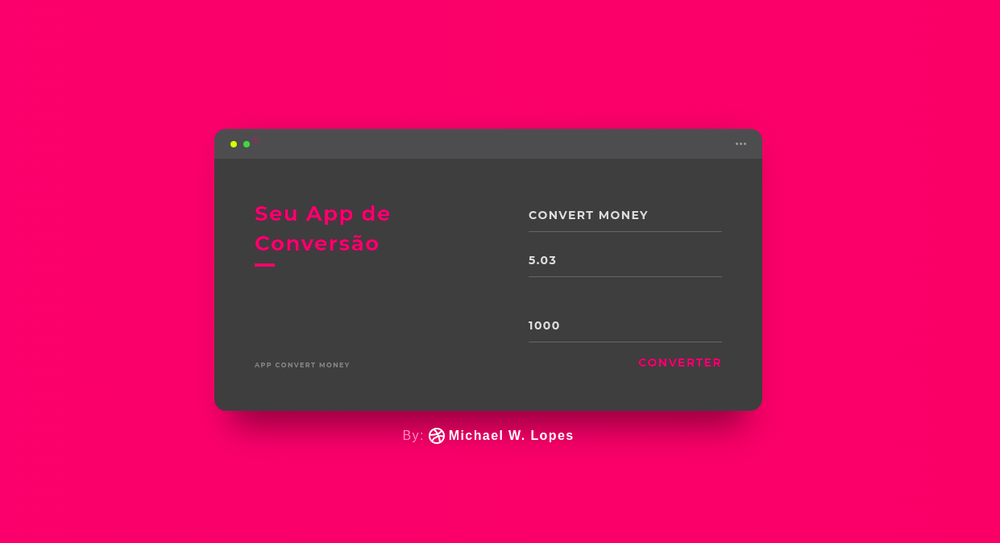
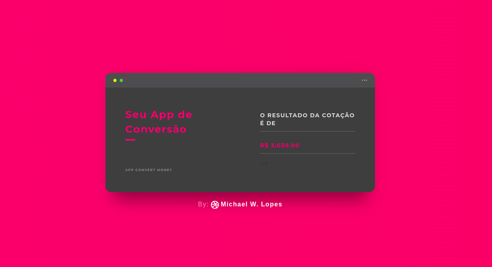

# Convert Money

Convert Money é uma aplicativo web simples de conversão de dolar para o real. O projeto é construido em Node.js, utilizando express, ejs e axios. Ele também conta com uma parte de testes utilizando Jest. Além disso, um tamplate UI foi utilizado como inspiração para a interface desse aplicativo.






### 🔧 Instalação

Depois de fazer uma cópia ou o download do projeto, utilizando um terminal, entre na pasta do projeto e digite um dos comandos abaixo para instalar as dependencias do projeto.

```
yarn 
npm 
```
Após a instalação, utilize um dos comandos abaixo par iniciar a aplicação. Após a execução do comando, acesse no seu navegador o local http://localhost:3000 

```
node index.js
npm start
yarn start
```

## ⚙️ Executando os testes

Para executar os teste digite um dos comando abaixo.

```
npm test
yarn test
```

---
⌨️ com ❤️ por [Michael Wellington Lopes](https://github.com/michaelwell23) 😊